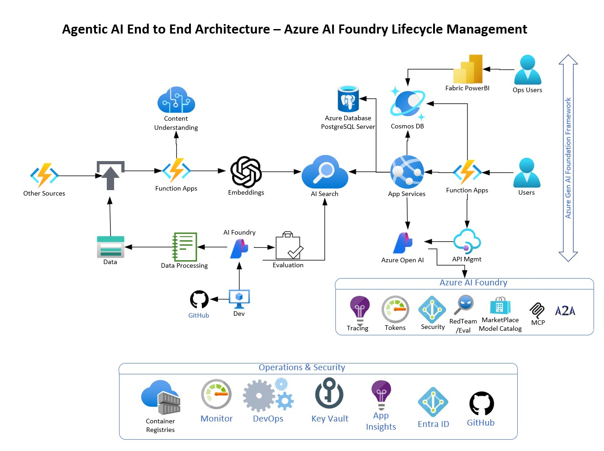

# Agentic AI Technical Architecture end to end with Azure AI Foundry as LifeCycle Management

## Overview

- Create a end to end architecture for building agentic AI applications using Azure AI Foundry as the lifecycle management platform.
- Define the components and services involved in the architecture.
- Also show the development tools and processes used to build, deploy, and manage agentic AI applications.
- Also show the knowledge creation and management aspects of the architecture.

## Architecture

## Architecture Components

- From the left you can see the knowledge creation and Development tools and processes.
- We are using Azure AI Search to create vector embeddings from documents and other knowledge sources.
- Ability to process documents with text, image, tables, audoio and video.
- Build an index for multi modal search and retrieval.
- Idea here is to use PaaS service components to show case Cloud Native AI application architecture.
- Also code is stored in Github and we use local development tools like VS Code and Azure AI Foundry, with python SDKs to build the agentic AI applications.
- Once the code is built and tested we use CI/CD pipelines to deploy the code to Azure AI Foundry.
- Development will involve Responsible AI practices and testing.
- Development will also involve Red Teaming to secure the application.
- From the right side it's more about the end user experience and application architecture.
- it could be chat web based, or mobile based or voice based.
- AI application will involve application meta data, application storage and application logic.
- Now we are using agents to build the AI application.
- Agents life cycle will be managed by Azure AI Foundry.
- The Bottom common services cut across the agentic ai and also corresponding application across the the entire lifecycle for end user experience.
- Common services include security, monitoring, logging, auditing, billing and cost management.
- Also other data data sources from other clouds or SaaS or PaaS based business applications can be added to the architecture.
- Most enterprise applications will have hybrid and multi cloud architecture.

## Conclusion

- This architecture provides a comprehensive view of building agentic AI applications using Azure AI Foundry as the lifecycle management platform.
- It highlights the key components and services involved in the architecture, as well as the development tools and processes used to build, deploy, and manage agentic AI applications.
- The architecture also emphasizes the importance of knowledge creation and management in building effective agentic AI applications.
- By leveraging Azure AI Foundry and other Azure services, developers can create scalable, secure, and efficient agentic AI applications that meet the needs of modern businesses.
- Built for Security, Scalability, Reliability, Performance, Agility and Cost Optimization.