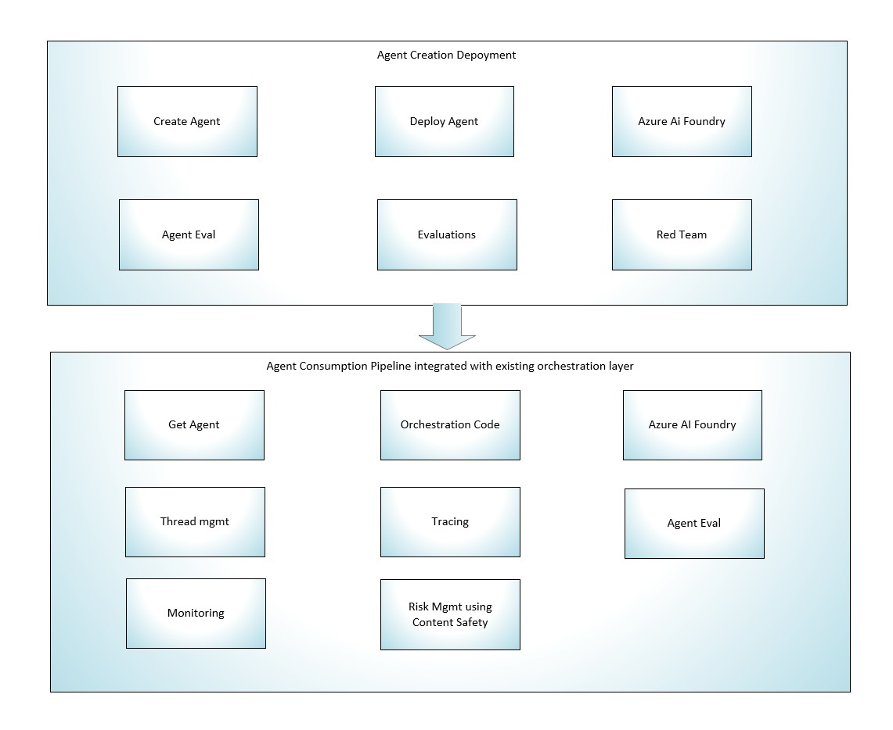

# Azure AI Foundry Agent Ops - AgentOps

## Overview

AgentOps is a comprehensive framework for managing and orchestrating AI agents within the Azure AI Foundry environment. It provides a structured approach to the entire lifecycle of AI agents, from development through production deployment and ongoing maintenance. This framework ensures that agents are properly evaluated, tested, deployed, and monitored while maintaining compliance, governance, and operational excellence.

## Key Challenges Addressed

- How can we deploy agents and register them to reuse across multiple solutions?
- How can we monitor and manage the lifecycle of agents effectively?
- Once agents are evaluated and Redteam/Responsible AI tested, how can we promote them to production?
- How can we implement version control for agents and their configurations?
- How can we ensure compliance and governance for agents in production?
- How can we monitor agent performance and usage in production environments?
- How can we handle updates and maintenance for agents in production?

## Agent Ops Flow Architecture

The AgentOps framework follows a structured, multi-stage pipeline that ensures quality, security, and reliability throughout the agent lifecycle.

### 1. Development Phase

#### Agent Creation

- Developers create AI agents using Azure AI Foundry's development tools
- Define agent capabilities, tools, and integration points
- Configure agent parameters, prompts, and behavior patterns
- Implement custom functions and tool integrations
- Set up agent personas and instruction sets

#### Local Testing

- Test agents in isolated development environments
- Validate basic functionality and tool integrations
- Debug agent responses and behavior
- Iterate on prompt engineering and configuration
- Test with sample datasets and scenarios

#### Version Control

- Store agent configurations in Git repositories
- Track changes to agent definitions, prompts, and configurations
- Maintain version history for rollback capabilities
- Use branching strategies for parallel development
- Document changes and agent evolution

### 2. Evaluation and Testing Phase

#### Automated Evaluation

- Run comprehensive evaluation metrics on agent performance
- Test against predefined benchmarks and success criteria
- Measure response quality, accuracy, and relevance
- Evaluate latency, token usage, and cost efficiency
- Generate evaluation reports and scorecards

#### Red Team Testing

- Conduct adversarial testing to identify vulnerabilities
- Test for prompt injection and jailbreak attempts
- Validate security controls and access restrictions
- Assess agent behavior under edge cases
- Document security findings and remediation steps

#### Responsible AI Assessment

- Evaluate agents against Microsoft Responsible AI principles
- Test for bias, fairness, and inclusivity
- Assess transparency and explainability
- Validate content safety filters and guardrails
- Ensure compliance with ethical AI guidelines
- Review privacy and data protection measures

#### Performance Testing

- Load testing for concurrent user scenarios
- Stress testing under high-volume conditions
- Measure response times and throughput
- Identify performance bottlenecks
- Optimize resource utilization

### 3. Registration and Governance Phase

#### Agent Registry

- Register validated agents in a centralized catalog
- Define agent metadata, capabilities, and dependencies
- Assign unique identifiers and version numbers
- Document usage guidelines and best practices
- Establish agent ownership and maintenance responsibility

#### Governance Controls

- Implement role-based access control (RBAC)
- Define approval workflows for agent promotion
- Establish compliance checkpoints
- Configure audit logging and tracking
- Set up policy enforcement mechanisms

#### Configuration Management

- Store approved agent configurations
- Manage environment-specific settings
- Handle secrets and credentials securely in Azure Key Vault
- Maintain configuration baselines
- Track configuration drift

### 4. Deployment Phase

#### Staged Deployment

- **Development Environment**: Initial testing and validation
- **Staging Environment**: Pre-production testing with production-like data
- **Production Environment**: Live deployment to end users

#### Deployment Strategies

- Blue-Green Deployment: Maintain two identical environments for zero-downtime updates
- Canary Deployment: Gradual rollout to subset of users
- Rolling Deployment: Incremental updates across instances
- Feature Flags: Toggle agent features on/off without redeployment

#### Infrastructure as Code

- Use Azure Bicep or Terraform for infrastructure provisioning
- Automate deployment pipelines with Azure DevOps or GitHub Actions
- Implement CI/CD practices for agent updates
- Ensure reproducible deployments across environments

### 5. Production Operations Phase

#### Monitoring and Observability

##### **Real-time Monitoring**

- Track agent invocations and usage patterns
- Monitor response times and latency metrics
- Observe token consumption and costs
- Alert on anomalies and threshold breaches
- Dashboard visualization in Azure Monitor

##### **Application Insights Integration**

- Distributed tracing for agent interactions
- Dependency tracking across services
- Performance profiling and diagnostics
- Custom metrics and events
- Log aggregation and analysis

##### **Agent-Specific Metrics**

- Success/failure rates
- User satisfaction scores
- Tool invocation patterns
- Conversation completion rates
- Error types and frequencies

#### Logging and Auditing

- Comprehensive logging of all agent interactions
- Audit trails for compliance requirements
- Privacy-compliant logging (PII redaction)
- Log retention policies
- Security event monitoring

#### Performance Optimization

- Continuous performance tuning based on metrics
- Prompt optimization for better responses
- Caching strategies for common queries
- Resource scaling based on demand
- Cost optimization initiatives

### 6. Maintenance and Updates Phase

#### Version Management

- Semantic versioning for agent releases
- Backward compatibility considerations
- Deprecation policies for old versions
- Migration paths for existing users
- Version rollback procedures

#### Update Procedures

- Scheduled maintenance windows
- Zero-downtime update strategies
- Testing updates in non-production environments
- Communication plans for stakeholders
- Rollback plans for failed updates

#### Continuous Improvement

- Analyze user feedback and interaction data
- Identify areas for enhancement
- Refine prompts based on real-world usage
- Add new capabilities and tools
- Update models and configurations

### 7. Compliance and Security

#### Ongoing Compliance

- Regular compliance audits
- Adherence to industry standards (ISO, SOC, GDPR, HIPAA)
- Policy updates and enforcement
- Certification maintenance
- Regulatory reporting

#### Security Practices

- Regular security assessments
- Vulnerability scanning and patching
- Access reviews and updates
- Threat detection and response
- Security incident management

#### Data Governance

- Data classification and handling
- Privacy impact assessments
- Data retention and deletion policies
- Cross-border data transfer compliance
- Consent management

## Agent Reusability Framework

### Modular Agent Design

- Create specialized agents for specific tasks
- Design agents with clear interfaces and contracts
- Implement standard input/output formats
- Use common tool and function patterns
- Enable agent composition and orchestration

### Agent Library

- Maintain a library of reusable agents
- Categorize agents by function and domain
- Provide documentation and examples
- Share best practices and patterns
- Enable discovery and search capabilities

### Multi-Solution Integration

- Deploy agents across multiple applications
- Share agents between teams and projects
- Implement agent-as-a-service patterns
- Use API gateways for agent access
- Manage cross-application dependencies

## Tools and Technologies

### Azure AI Foundry Components

- **Azure AI Studio**: Development and testing environment
- **Azure OpenAI Service**: LLM capabilities
- **Prompt Flow**: Agent orchestration and workflow
- **AI Search**: Knowledge retrieval and grounding
- **Content Safety**: Guardrails and filtering

### DevOps Integration

- **Azure DevOps**: CI/CD pipelines and project management
- **GitHub Actions**: Automated workflows
- **Azure Pipelines**: Build and deployment automation
- **Infrastructure as Code**: Bicep, Terraform, ARM templates

### Monitoring and Logging

- **Azure Monitor**: Comprehensive monitoring solution
- **Application Insights**: APM and diagnostics
- **Log Analytics**: Centralized log management
- **Azure Dashboards**: Visualization and reporting

### Governance and Security

- **Azure Policy**: Compliance enforcement
- **Microsoft Entra ID**: Identity and access management
- **Azure Key Vault**: Secrets management
- **Microsoft Purview**: Data governance

## Best Practices

### Development Best Practices

1. **Start Simple**: Begin with basic agent functionality and iterate
2. **Test Early**: Implement testing from the beginning
3. **Document Thoroughly**: Maintain clear documentation for agents
4. **Use Version Control**: Track all changes systematically
5. **Follow Standards**: Adhere to organizational coding and naming conventions

### Deployment Best Practices

1. **Automate Everything**: Use CI/CD for all deployments
2. **Test in Staging**: Always validate in staging before production
3. **Plan Rollbacks**: Have rollback procedures ready
4. **Communicate Changes**: Inform stakeholders of updates
5. **Monitor Closely**: Watch metrics during and after deployment

### Operations Best Practices

1. **Proactive Monitoring**: Set up alerts before issues occur
2. **Regular Reviews**: Conduct periodic performance reviews
3. **Cost Management**: Monitor and optimize costs continuously
4. **Security First**: Prioritize security in all operations
5. **User Feedback**: Continuously gather and act on feedback

### Governance Best Practices

1. **Clear Ownership**: Define clear ownership for each agent
2. **Regular Audits**: Conduct compliance and security audits
3. **Policy Enforcement**: Automate policy compliance checks
4. **Access Control**: Implement least privilege access
5. **Change Management**: Follow formal change management processes

## Metrics and KPIs

### Performance Metrics

- Average response time
- Throughput (requests per second)
- Token usage per interaction
- Cost per interaction
- Concurrent user capacity

### Quality Metrics

- User satisfaction scores
- Task completion rates
- Accuracy and relevance scores
- Error rates
- Retry/fallback frequency

### Business Metrics

- Total cost of ownership (TCO)
- Return on investment (ROI)
- User adoption rates
- Time saved vs manual processes
- Number of reusable agents deployed

### Operational Metrics

- Deployment frequency
- Mean time to recovery (MTTR)
- Change failure rate
- Lead time for changes
- Availability and uptime

## Conclusion

The Azure AI Foundry AgentOps framework provides a comprehensive, enterprise-ready approach to managing AI agents throughout their entire lifecycle. By following this structured methodology, organizations can ensure that their AI agents are reliable, secure, compliant, and continuously improving. The framework enables teams to build once and deploy across multiple solutions, maximizing reusability and minimizing redundant effort while maintaining the highest standards of quality and governance.

This approach transforms AI agent development from ad-hoc experimentation into a mature, production-ready discipline that can scale across the enterprise while maintaining control, visibility, and accountability at every stage.